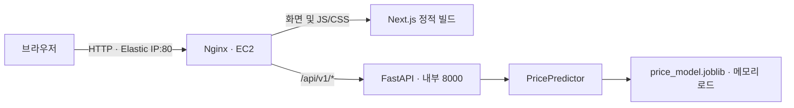

# 중고차 가격 예측 웹 애플리케이션 설계

작성일: 2026-09-16. 아래는 구현 전 작성한 최초 설계 기록이며, 실제 배포 결과는 연결된 운영 문서를 따른다.

구현 후 변경: 최신 모델의 사고 이력 입력을 추가했으며, EC2 관리는 SSH 대신 SSM 전용 IAM 역할을 사용한다. 아래는 최초 설계 기록이다. 실제 실행·배포 방법은 [deploy/README.md](deploy/README.md), 배포 상태는 [deploy/DEPLOYMENT.md](deploy/DEPLOYMENT.md)를 따른다.

## 1. 권장 구성

Next.js + TypeScript + Tailwind CSS로 단일 화면을 만들고 정적 export한다. Nginx가 정적 파일을 제공하며 `/api/` 요청을 FastAPI로 전달한다. 서울 리전의 EC2 한 대에서 Docker Compose로 Nginx와 FastAPI 두 컨테이너를 운영한다. DB, 로그인, 예측 이력 저장, Redis, 로드밸런서는 초기 범위에서 제외한다.



브라우저는 상대 경로 `/api/v1/predict`로 요청한다. 같은 origin이므로 운영 환경의 CORS 허용 설정과 공개 API 호스트 환경변수가 필요 없다. Nginx는 `/api/` 접두사를 제거하지 않고 FastAPI에 전달한다. 개발 시에는 로컬 프록시 또는 localhost origin만 허용한다.

Next.js는 `output: 'export'`를 사용하며 런타임 Node.js 서버가 없다. 폼과 API 호출은 Client Component에서 처리한다. Server Actions, Next.js API Route, SSR은 사용하지 않는다. 공식 근거: [Next.js static exports](https://nextjs.org/docs/app/guides/static-exports).

## 2. 현재 모델과의 연결

설계 근거는 참조 작업 ‘중고차 가격 예측 Feature 검토’ 및 현재 `price_model.py`, `train_model.py`, `artifacts/metrics.json`, `artifacts/data_audit.json`이다. 모델 작업이 진행 중이므로 배포 시 최종 산출물을 다시 확인한다.

| 항목 | 확인된 상태 / 설계 결정 |
|---|---|
| 추론 인터페이스 | `PricePredictor.predict(make_name, model_name, vehicle_age, mileage)` 재사용 |
| 모델 | scikit-learn HistGradientBoostingRegressor 기반 파이프라인 |
| Feature | 제조사+모델 결합 범주, 차령, 주행거리 |
| 파일 | `artifacts/price_model.joblib`, 약 446KB. 실제 프로세스 메모리는 별도 측정 |
| 지원 차종 | 학습 제조사+모델 조합 1,108개. `bundle['model_support']`를 기준으로 제공 |
| 전역 범위 | 현재 차령 0~30년 정수, 주행거리 0~300,000. `bundle['input_ranges']`에서 동적으로 읽음 |
| 학습 기간 | 매물 등록일 기준 2010-11-03~2020-08-31 |
| 검증 기간 | 2020-09-01~2020-09-13 |
| 검증 지표 | MAE 약 3,396, MAPE 약 14.59%. 현재 시장 정확도 또는 개별 예측 구간을 의미하지 않음 |
| 단위 | 코드상 원본 CSV 가격·거리 단위. USD, KRW, mile, km로 임의 확정하거나 환산하지 않음 |

차령은 모델 정의에 맞는 연도 차이다. UI에서는 `차령(년)`을 직접 받는다. 현재 연도에서 연식을 자동 차감해 과거 모델의 현재 시세 예측처럼 보이게 만들지 않는다.

모델 파일에는 정규화된 제조사·모델 키가 있다. 초기 카탈로그는 이 키를 그대로 사용해도 되며, 표시용 원문 이름이 필요하면 학습 단계에서 별도 매핑을 내보낸다. 프론트엔드에 차종 목록을 하드코딩하지 않는다.

## 3. 화면

모바일은 한 열, 데스크톱은 입력 폼과 결과 카드를 두 열로 배치한다. Tailwind 기본 스타일로 충분하다.

1. 제목: `중고차 가격 예측`.
2. 설명: `제조사·모델, 차령, 주행거리로 과거 매물 기준 가격을 추정합니다.`
3. 제조사 선택 → 해당 제조사의 모델 선택. 제조사가 바뀌면 기존 모델 선택을 초기화한다.
4. 차령 숫자 입력 및 주행거리 숫자 입력. 허용 범위와 거리 단위를 입력란 옆에 표시한다.
5. `가격 예측하기` 버튼. 필수값 누락 또는 요청 중이면 비활성화한다.
6. 결과: 예상 가격, 단위, 실제 요청한 차량 조건, 모델 버전, 지원 표본 수, 모델 경고를 표시한다.
7. 공통 안내: `과거 매물 가격에 기반한 추정이며 현재 거래 시세가 아닙니다.`

단위가 확정되기 전에는 `가격(원본 데이터 단위)`, `주행거리(원본 데이터 단위)`로 표시한다. 일반 소비자용 공개 전에는 데이터 출처에서 단위를 확인하여 메타데이터와 안내 문구를 함께 확정한다.

로딩, 입력 오류, 미지원 차종, 서버 오류, 요청 제한, 메타데이터 조회 실패 상태를 구분한다. 메타데이터 조회 실패 시 폼을 비활성화하고 재시도 버튼을 보여준다. 입력 변경 시 이전 결과를 지우며, 이전 요청의 늦은 응답이 새 입력의 결과처럼 표시되지 않도록 요청 취소 또는 요청 ID 검증을 적용한다. 입력 label과 필드별 오류 연결, 키보드 조작, 결과 `aria-live`를 지원한다.

예측값에 MAE를 더하고 빼서 신뢰구간처럼 표시하지 않는다. 초기 UI에는 단일 예측값과 검증된 경고만 제공한다.

## 4. API 계약

| Method | Path | 동작 |
|---|---|---|
| GET | `/api/v1/metadata` | 모델 버전, 단위 상태, 기간, 입력 범위, 제조사별 모델 목록 및 차종별 표본 수·범위 |
| POST | `/api/v1/predict` | 한 차량의 가격 예측 |
| GET | `/api/health/live` | 프로세스 생존 상태 |
| GET | `/api/health/ready` | 모델 로드·워밍업 완료 여부. 미완료 시 503 |

예측 요청:

```json
{
  "make_name": "Toyota",
  "model_name": "Camry",
  "vehicle_age": 5,
  "mileage": 60000
}
```

응답은 기존 `PricePredictor`의 `predicted_price`, 정규화된 입력, `training_examples_for_model`, `price_unit`, `mileage_unit`, `warnings`를 유지하고 `model_version`, `request_id`를 추가한다. `warnings`는 기존 문자열 배열이며 UI에서 알려진 문구를 번역하고 알 수 없는 경고도 누락하지 않는다. 원본 단위가 미확정임을 나타내는 `units_verified: false`는 metadata로 제공한다.

| 상태 | 처리 |
|---|---|
| 200 | 정상 예측. 표본 100개 미만 또는 차종별 관측 범위 밖은 기존 모델 정책대로 경고 동반 |
| 422 | 필수값 누락, 미지원 제조사+모델, 전역 범위 초과, 음수, NaN/무한대, 잘못된 타입 |
| 429 | Nginx 요청 제한. 한국어 재시도 안내 및 Retry-After 헤더 |
| 503 | 모델 미준비 또는 추론 동시 처리 한도 초과 |
| 500 | 예상하지 못한 오류. 내부 traceback은 응답에 노출하지 않음 |

Pydantic 스키마는 추가 필드를 거절하고 문자열 길이를 제한한다. 차령은 strict integer, 주행거리는 유한한 숫자로 검증하며 bool·문자열 숫자도 거절한다. 실제 지원 범위·조합 판정은 기존 모델과 공유하여 UI와 API가 다른 기준을 갖지 않게 한다. 전역 범위 초과값을 자동 보정하지 않는다. API 오류는 `error.code`, `error.message`, `error.field`, `request_id` 형식으로 통일한다. Nginx가 직접 생성하는 429/502/504도 JSON으로 처리하고 프론트는 비JSON 장애 응답에 대한 기본 오류 문구를 갖는다.

## 5. 추론 프로세스

FastAPI lifespan에서 모델을 한 번 로드하고 알려진 정상 입력으로 워밍업한다. 실패하면 프로세스 시작을 실패시켜 손상된 모델로 서비스하지 않는다. 요청마다 파일을 읽거나 학습하지 않는다. [FastAPI lifespan](https://fastapi.tiangolo.com/advanced/events/)

Uvicorn worker 1개, 추론 동시 실행 1개로 시작한다. 동기 추론은 제한된 executor에서 수행하여 이벤트 루프를 막지 않는다. 대기열은 무한히 늘리지 않고 포화 시 503을 반환한다. `OMP_NUM_THREADS=1`, `OPENBLAS_NUM_THREADS=1`, `MKL_NUM_THREADS=1`을 초기값으로 두고 부하 테스트 후 조정한다. 클라이언트 타임아웃은 계산 중단을 보장하지 않으므로 추론 슬롯은 실제 계산 완료 후 반환한다.

학습 환경의 Python 및 scikit-learn/pandas/numpy/joblib 버전을 잠근다. 현재 기록은 Python 3.11.9, scikit-learn 1.8.0, pandas 3.0.3, numpy 2.4.5, joblib 1.3.2다. 모델과 환경 변경은 함께 검증한다. [scikit-learn 모델 저장 및 호환성](https://scikit-learn.org/stable/model_persistence.html)

## 6. AWS 및 공개 접근

| 리소스 | 초기 제안 |
|---|---|
| 리전 | 서울 `ap-northeast-2` |
| EC2 | `t3.small`, x86_64, 2 vCPU / 2GiB, On-Demand 1대 |
| OS | Ubuntu 24.04 LTS |
| 디스크 | 암호화 gp3 EBS 20GB |
| 네트워크 | 퍼블릭 서브넷, Internet Gateway, 기본 인터넷 라우트 |
| 고정 주소 | Elastic IP 1개, 인스턴스에 연결 |
| 공개 포트 | TCP 80 전체 공개. FastAPI 8000은 Docker 내부망 전용 |
| 관리 접근 | SSH 22를 관리자 IP /32로만 허용하고 키 인증. 전체 인터넷에 개방하지 않음 |
| 실행 | Docker Compose 2개 서비스, `restart: unless-stopped`, 부팅 시 Docker 시작 |

접속 주소는 `http://<Elastic-IP>/`이다. 고정 IP는 인스턴스를 교체할 때 재연결한다. HTTPS는 초기 범위에 포함하지 않아 HTTP 통신은 암호화되지 않는다. 이 화면은 차량 조건만 받고 개인정보·계정·결제정보는 받지 않는다. 향후 필요하면 IP 주소용 인증서와 자동 갱신을 별도 설계할 수 있다.

`t3.small`은 저트래픽 데모의 시작 사양이며 처리량 보장은 아니다. 정적 빌드를 로컬 또는 CI에서 수행하여 EC2 빌드 메모리를 절약한다. 실제 RSS, 응답 지연, CPU credit을 측정하고 부족하면 `t3.medium` 4GiB로 올린다. CPU credit mode는 비용 예측을 위해 Standard를 초기 제안하며 지속 부하 시 성능 제한을 감안한다. [T3 사양](https://aws.amazon.com/ec2/instance-types/t3/), [Elastic IP](https://docs.aws.amazon.com/AWSEC2/latest/UserGuide/elastic-ip-addresses-eip.html)

월 비용은 `서울 EC2 시간당 요금 × 730시간 + gp3 20GB + 공인 IPv4 + 송신 트래픽 + 선택한 모니터링/백업`으로 산정한다. 공개 IPv4 기본요금은 시간당 $0.005로 730시간 기준 약 $3.65이며 EC2·디스크 비용과 별도다. 총액은 생성 시점 서울 리전 견적으로 확정하고 무료 티어를 전제하지 않는다. [EC2 요금](https://aws.amazon.com/ec2/pricing/on-demand/), [IPv4 요금](https://aws.amazon.com/vpc/pricing/)

단일 EC2 장애나 재시작 시 서비스 중단이 발생한다. 초기에는 짧은 배포 중단을 허용한다.

## 7. 인증 없는 공개 서비스 운영

- 예측 경로에 IP별 초당 1회, burst 5의 Nginx 제한을 시작값으로 적용한다. 실제 remote address 기준으로 제한하고 클라이언트가 전달한 X-Forwarded-For를 임의로 신뢰하지 않는다.
- 요청 본문은 최대 4KB, Nginx upstream timeout은 10초, 프론트 timeout은 12초를 초기값으로 둔다. 메타데이터 조회는 별도 제한을 둔다.
- 이는 사용량 제어이며 분산 공격 방어를 보장하지 않는다. 정상 사용자의 공유 IP 제한은 운영 중 조정한다.
- API 컨테이너는 non-root로 실행하고 공개 포트 매핑을 만들지 않는다. 모델은 검증한 배포 산출물만 read-only로 탑재하고 업로드 엔드포인트를 제공하지 않는다.
- Docker 빌드 컨텍스트에서 원본 CSV, training_data.pkl, .git, 로컬 비밀값을 제외한다. joblib은 신뢰된 파일만 로드한다.
- 로그에는 request ID, 모델 버전, 상태 코드, 처리 시간만 기본 기록한다. 프록시 접근 로그의 IP 보관도 필요한 기간으로 제한한다. 컨테이너 로그 회전은 파일당 10MB, 3개부터 시작한다.
- EC2 상태 검사·CPU·CPU credit 알림과 예산 알림을 설정한다. 메모리 감시는 선택적으로 CloudWatch Agent를 설치한다. 컨테이너 healthcheck는 상태 표시이며 자동 복구 자체는 아니므로, 프로세스 종료 재시작과 멈춤 감지 후 재시작 경로를 별도로 검증한다.

## 8. 코드 및 배포 구조

기존 학습 코드를 유지하고 아래 구조를 추가한다.

```text
usedcar/
  price_model.py
  train_model.py
  artifacts/price_model.joblib
  backend/
    app/main.py
    app/schemas.py
    app/model_service.py
    tests/
    requirements.lock
    Dockerfile
  frontend/
    app/page.tsx
    components/PredictionForm.tsx
    components/PredictionResult.tsx
    lib/api.ts
    next.config.ts
    package-lock.json
  deploy/
    compose.yaml
    nginx.conf
    Dockerfile.web
    README.md
  .dockerignore
```

배포 순서:

1. 모델 최종본·단위·환경 버전을 확정하고 SHA-256 기반 모델 버전을 부여한다.
2. 로컬 또는 CI에서 linux/amd64 API 이미지와 Next.js 빌드를 포함한 Nginx 이미지를 만든다. 모델·메타데이터는 같은 API 이미지에 묶는다.
3. 학습 코드와 API가 같은 입력에 같은 예측값을 내는지 검사하고 이미지를 변경 불가능한 버전 태그로 보관한다.
4. EC2, 보안 그룹, EBS, Elastic IP를 생성하고 Docker를 설치한다. 최초에는 이미지 tar를 SSH로 전송하고 `docker load`하는 방식이면 별도 레지스트리 없이 배포할 수 있다.
5. 두 이미지 태그를 함께 고정한 Compose 배포 후 ready와 외부 IP의 화면·예측을 확인한다.
6. 이전 이미지와 Compose 버전을 유지한다. 실패 시 이전 버전으로 되돌리고 ready를 확인한다. 인스턴스 디스크 외부에도 배포 산출물을 보관하여 재생성 가능하게 한다.

## 9. 완료 기준

- 제조사 변경에 따른 모델 초기화, 모바일 폼, 로딩·오류·재시도 표시가 동작한다.
- 정상 입력, 미지원 조합, 음수, 소수 차령, bool, 비유한 수, 전역 범위 초과를 검증한다.
- 차종별 범위 경고와 희소 표본 경고가 기존 PricePredictor와 일치한다.
- 단위 미확정 상태 및 과거 데이터 안내가 결과 화면에서 확인된다.
- 모델이 손상되거나 없으면 ready가 성공하지 않고 정상 가격을 반환하지 않는다.
- 8000 포트는 외부에서 접근할 수 없고 공개 예측 요청 제한은 429로 확인된다.
- 알려진 입력의 CLI/API 일치, 컨테이너 재시작, EC2 재부팅, 이전 버전 롤백을 검증한다.
- 대상 EC2에서 워밍업 후 총 1req/s 부하를 5분간 가해 p95 1초 이내·5xx 0건을 초기 목표로 측정한다. 이 수치는 미검증 목표이며 결과에 따라 인스턴스 및 제한을 조정한다.

구현 우선순위는 FastAPI 어댑터 및 metadata → Next.js 폼/결과 → Docker/Nginx → EC2 배포와 실측 순서다.
